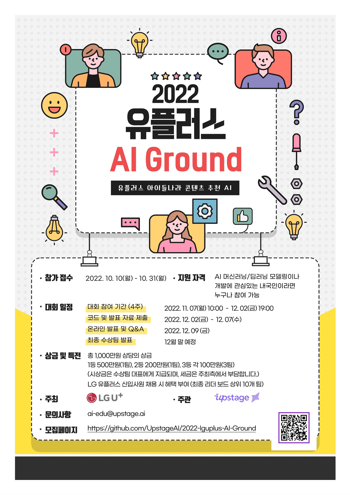
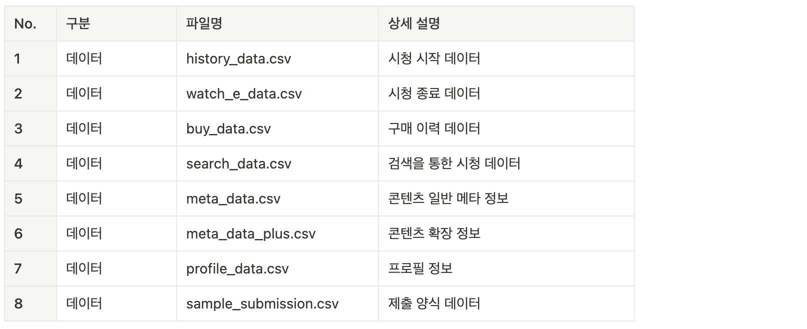
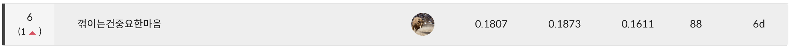
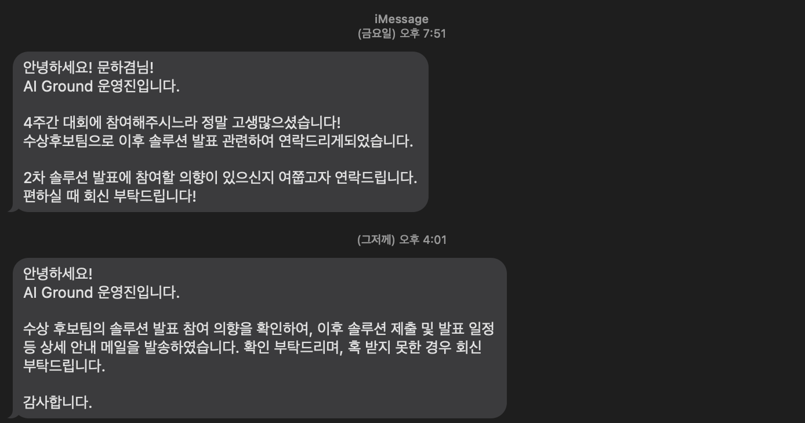

[TOC]

# 2022 유플러스 AI Ground

## 소개 

- 2022 유플러스 AI Ground는, 캐릭터부터 교육용 콘텐츠까지 다양한 콘텐츠를 제공하는

  **유아-아동 전용 미디어 서비스 ‘아이들나라’의 AI Task 및 실제 사용자 데이터**를 바탕으로,

  **새로운 추천 아이디어 및 프로필별 맞춤형 콘텐츠 추천 AI 모델을 개발하는 AI 경진대회** 입니다.

## 데이터 개요

- 유플러스 아이들나라 유아-아동 전용 서비스에는 시청, 구매 이력, 프로필 정보 등 다양한 데이터가 존재합니다. 데이터는 csv 파일 형태이며, sample_submission 파일을 포함하여 총 7개의 파일로 구성되어 있습니다.

  전체 데이터는 5개월의 기간(3월 ~ 7월)이며, 데이터 대회 참가자에게 제공되는 학습 데이터는 가장 먼저 적재된 2개월치 데이터입니다. 제공된 학습 데이터를 통하여 사용자가 이후 시청할 콘텐츠를 추천하는 것이 최종 목표입니다. 

## 컴페티션 들어가기전 목표

NLP로 현재 밥 벌어 먹고 있지만 평생 할 거란 생각은 하지 않기 때문에 추천시스템을 찍먹이라도 해보겠다는 마인드였다.

또 NLP의 경우 허깅페이스의 transformers라는 좋은 라이브러리 덕에 모델링하기 편하긴 하지만 비전, 음향의 일부 모델을 제외하고는 NLP 모델 뿐이 지원 안하기 때문에 이참에 다시한번 파이토치를 통해 모델링에 익숙해져야 한다는 불안 아닌 불안감이 있었다.

-> 추천시스템 찍먹 + 파이토치 다시 익히기

파이토치의 경우 그래도 트레이너가 있는게 편하긴 해서 파이토치 라이트닝을 익히는 길로 방향을 잡았다.

## 모델링

history data와 profile_data만을 사용했고

Denoting AutoEncoder 기반의 추천 모델을 사용했다.

이유는 딱히 없고 그냥 컴페티션을 들었을 때 막연하게 

'추천 아이템을 복원하도록 오토인코더를 사용하면 latent space에서는 비슷비슷한 유저끼리 모여있게 클러스터링이 되지 않을까? 그러면 거리가 가까운 유저를 참고해서 추천을 해주면 잘 되지 않을까?' 라는 막연한 생각이었다.

다만 결과적으로는 latent space의 거리를 이용하기 보다는 DAE로 인풋을 손상시키고 그를 통해 복원 시키는 와중에서 아이템의 상관관계를 모델이 학습하게 한 후, 인퍼런스 과정에서는 손상되지 않은 아이템 기록을 넣어줘서 복원 되는 애들(모델 입장에서는 손상 되었다고 생각해서 봤음 직한 녀석을 추천한다.)을 추천하게 하게 했다.

추천 시스템의 컴페티션은 처음이지만 선 모델링 후 논문을 보니 오토인코더 기반의 추천 시스템이 꽤나 보이는 모양, SOTA는 VAE 기반의 오토인코더였지만 넷플릭스 같이 대용량 데이터에만 될 것 같기도 하고, 이번 컴페티션처럼 데이터가 적은(유저가 8천명 가량 밖에 없었다.) 경우는 DAE가 상위권을 차지하고 있었다.

-> 한마디로 운이 좋았다. 소 뒷걸음 질 치다 쥐를 잡았다.

여튼 아이템을 복원하는 것 말고 latent space에서 아이템 벡터와 유저 벡터를 concat 시켜 유저에 따른 아이템을 복원하도록 만들었다.

다음과 같은 시나리오다.

- 1,2의 유저가 각각 시청 기록이 하나밖에 없다. -> 유저의 정보는 비슷하다(Sparse 벡터)

- 1은 dropout 노이즈에 아이템이 손상되었고 2는 손상되지 않았다.

- 모델은 1을 복원할 때 확인 할 수 있는건 유저 정보밖에 없으므로 2번에서 학습된 아이템과 유저의 상관 관계를 토대로 복원하려고 한다.

- 만약 둘의 시청기록이 같지 않더라도 2번 유저의 영향이 있으므로 1번 유저는 자기 시청기록 뿐 아니라 2번이 시청한 아이템도 어느정도의 확률 값을 가지게 된다.

뭔가 야매스러운 접근 방식이지만 진짜 난 저렇게 생각하고 DAE를 사용했다.

## 결과

- 이게 된다고?
- 사실 초반에는 1등도 2~3일 정도 해서 지인들에게 자랑은 했지만 실제로는 시간이 지나면 퍼블릭 리더보드 뿐아니라 프라이빗에서 점수가 많이 내려가겠네 라는 생각이 있었다. (거의 모든 컴페티션에서 초반만 잘나갔다. 능력이라면 능력 😇)
- 프라이빗의 경우에는 오토인코더 기반 모델이기 때문에 시청한 아이템만 복원하면(denoising 이더라도) 사실상 본 아이템만 추천하는 요상한 녀석이 되지 않을까 하는 걱정도 있었다. 그래서 떨어질 줄 알았다.
- 근데 아니네요?
- 외됀데?

## 좋았던 점

- 컴페티션 하기전의 목표는 다 이뤘다.
- 언젠가 목표였던 적어도 수상 후보에는 들기(수상은 평생 무리지 않을까 😂)
- 새로운 도메인에서 성과를 내서 뭐든 할 수 있겠네 라는 근거없는 자신감이 생김

## 아쉬웠던 점

- 모델 재현을 신경쓰지 않고 실험만 주구장창 함 -> 그래서 순위권에 들고도 재현이 안되서 수상 가능성은 제로에 수렴하게 됨
- 랜덤시드는 당연히 고정했지만 컨피그가 바뀌고 모델 구조가 바뀌고 이것저것 바뀌다보니까 최고 성능 모델을 어떻게 만들었는지도 기억이 안남...
- 코드를 깨끗히 한다고 정리하고 정리하고 정리해서 생긴문제.. 적어도 복사본을 만들어서 어딘가에 짱박아뒀어야 했다.
- 아니면 처음부터 모든 가능성을 열어둔 파이프라인을 만들어서 하던가(근데 이건 이것대로 하면 코드가 더러워지고 버그가 생길 것 같다.)
- 변명을 하면 종료 일주일 전에 최고기록을 낸 걸 내가 다시 갱신해서 그때 재현을 신경쓰려고 했는데... 못올렸다. 😭 
- 변명이 아니라 자만이었구나.... 변명 거리조차 안된다.

## 총평

- 이번에도 꺾이고 말았다...
- 점수 올리는 재미에 중요한것을 잊고 말았다.
- 챙피함

