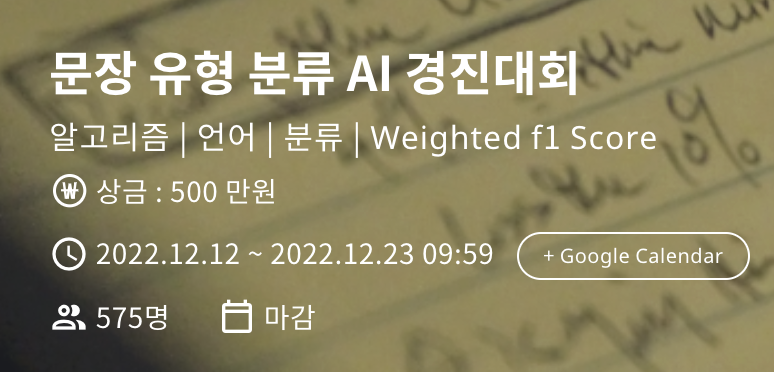
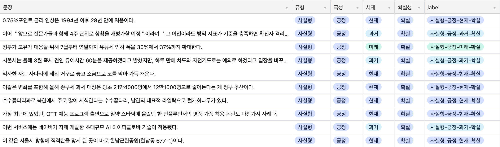

# 문장 유형 분류 AI 경진대회

## 주제

문장 유형 분류 AI 모델 개발

## 데이터 예시

## 목표

- 점수보다는 실험 파이프라인을 잘 구성하여 하루에 3번은 꼭 제출 (성공)
- Mecab을 이용한 추가 Feature 생성 (성공)
- 기존의 실험 결과를 참고하여 개선 방법 탐색 및 새로운 실험 설계(반반)
- 깨끗한 코드(실패...)

## 접근 방법

- Pretrained model에 Classification Head를 4개를 붙여 각각의 Label을 학습(MTL)
  - 각 label을 맞추는 네개의 모델을 병렬로 학습 시키기에는 Kfold까지 합치면 총 20개의 모델 check point가 나오는데 이를 앙상블해서 결과를 추론 하는 것은 깨끗해 보이지 않았다.(지극히 개인적인 생각)
  - 차라리 MTL을 하여 여러 모델을 앙상블 하는편이 깔끔하고 성능도 좋게 나올 것이라 판단했다. (오판인듯)
- Mecab을 이용하여 형태소 태깅을 한 결과물을 추가적으로 모델에게 학습
  - 각 label이 단어보다는 문장 내에서 가지고 있는 역할에 더욱 연관이 있을 거라 판단
  - 단어가 다르더라도 같은 형태소이면 모델이 그것을 보고 비슷한 역할을 할 수 있을 거라 생각함
  - 결과적으로 좀더 로버스트한 모델을 만들 수 있을거란 기대 (오판)

## 결과

| Public       | Private        |
| ------------ | -------------- |
| 8등 (0.7573) | 19등 (0.75255) |

- 대회 끝나기 3일? 4일 전까지는 쭉 1등을 했던 걸로 기억
- 다만 추가적인 성능 향상을 할 수 없었다. 
- 데이터가 불균형 했기 때문에 모델 구조, 데이터를 어떻게 넣느냐 보다는 어떻게 부족한 데이터를 증강할 수 있을지를 고민하고 실험 해보는게 맞았다고 생각함
- 문장 부호를 넣는 AEDA까지는 시도해 보았으나 다른 증강까지는 실험을 해보지 못했다. 아니 안했다. 단어가 바뀌거나 삭제되면 오히려 학습에 방해될 거란 생각 때문, 그러나 일단 해보고 직접 눈으로 결과를 보아야 했을 것 같다.(상위권 솔루션에는 효과를 보았다는 글을 보았다.)

## 총평 및 느낀점

- 성과는 못 냈지만 얻은건 많은 대회
- 다시는 꼼수(이번 같은 경우는 메캅을 이용한 형태소를 같이 모델에 넣는 것)를 쓰지 않겠습니다 -_-;
- 기초를 튼튼히 하는 것보다 좋은 성능 향상 방법은 없다.
- 어그멘테이션을 조금 더 주의 깊게 해보자.