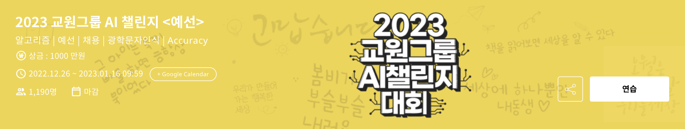

# 2023 교원그룹 AI챌린지 대회

https://dacon.io/competitions/official/236042/overview/description



## 주제

예선: 손글씨 폰트에 대한 OCR

본선: 유아의 손글씨에 대한 OCR

## 목표

- 처음 접해본 task(OCR)에 대한 공부와 이해
- 앞으로 하게 될지 모르는 OCR에 대한 팁 및 노하우 습득
- (언제나 그렇지만) 논리적인 실험 설계


## 접근방법

- Transformer base의 ocr 모델 탐색 -> TROCR을 찾음

  - TROCR은 vision encoder decoder 의 형태로 vision transformer와 lm 모델을 연결한 형태
  - 논문에서는 deit와 roberta를 연결 했다.
  - 나(우리 팀)의 경우 처음에는 vit와 klue/roberta를 연결 하려고 했으나 robeta의 토크나이저가 label에 대해서 꽤나 많은 unk 토큰을 내뱉기 때문에 다른 lm 모델을 탐색했다.
    - 그 결과 자소 단위의 토크나이저를 사용하는 KRBERT라는 것을 찾아냄(https://huggingface.co/snunlp/KR-BERT-char16424)
  - vit의 경우 swinv2로 변경 했을 경우 상당한 성능 개선이 있었음
  - 이후 마이크로소프트에서 공개한 TROCR 모델이 비록 영어지만 인코더 부분에서 글자에 대한 어떠한 weight를 학습 했을 거란 가정하에 공개된 TROCR의 인코더 부분의 가중치만 때내서 KRBERT를 연결하여 모델을 완성(성능이 가장 좋았음)

- 모델 파이프라인 관련

  - 보통의 transformers 라이브러리와 datasets 라이브러리를 함께 사용해서 학습하는 경우 모델에 데이터를 넣어주기 전에 map을 통해서 tensor로 변환하는 과정을 거치는데, 이럴 경우 그 과정이 너무 오래걸리고(물론 한번 한 이후에는 cache 되어서 빠르지만) 확률에 따른 어그멘테이션을 생각을 해서 data callator에서 데이터를 텐서로 변환하는 과정을 거치도록 만듬

    ```python
    @dataclass
    class DataCollatorForOCR:
        processor: TrOCRProcessor
        padding = True
        max_length: Optional[int] = None
        pad_to_multiple_of: Optional[int] = None
        return_tensors: str = "pt"
        
    		def __call__(self, features: List[Dict[str, Any]]) -> Dict[str, Any]:
        	images = [feature[DatasetColumns.pixel_values] for feature in features]
        	batch = self.processor(images, return_tensors=self.return_tensors)
        	if DatasetColumns.labels in features[0]:
            	texts = [feature[DatasetColumns.labels] for feature in features]
            	labels = self.processor.tokenizer(
                	texts, padding=self.padding, return_tensors=self.return_tensors
            	).input_ids
            	batch["labels"] = labels
        	return batch
    ```

- 어그멘테이션 관련

  - 깃허브에서 straug(https://github.com/roatienza/straug)라는 라이브러리를 찾아서 적용함
  - datasets에서 set_trasnform이라는 메서드를 활용해 데이터를 꺼내올 때마다 확률값에 따라 어그멘테이션이 적용된 코드가 나오도록 할 수 있었음


- 본선관련
  - 본선도 위의 예선에서 사용한 방법 그대로 사용 했지만 훈련 데이터에서 유니크한 labeldㅣ 600개 정도 밖에 안되서 학습을 하면 과적합 이슈가 발생 -> 테스트 셋에 대해서 훈련셋에 있는 label들로만 예측됨
  - 한국어로 학습된 TROCR(https://huggingface.co/daekeun-ml/ko-trocr-base-nsmc-news-chatbot) 의 디코더 부분은 인코더가 내뱉는 벡터에 대해서 글자로 출력을 내뱉는 학습이 되어있기 때문에 디코더는 냅두고(freeze 시키고) 인코더 부분만 학습된 데이터 분포에서 유아 손글씨 데이터 분포에도 디코더가 알아 볼 수 있는 벡터를 내뱉을 수 있기를 기대했다.(ex) '나'라는 레이블이 없어도 '가'와 '너'를 학습함으로 '나'의 분포도 알 수 있게 shift 되는 것을 기대)


## 결과

예선 : public 1위 private 2위

본선 : public 9위 private 9위 (예선 상위 10팀만 진 -> 즉 10팀중 9등 😇)


## 코드

https://github.com/YooSungHyun/kyowon_ocr

(현재 private지만 곧 public 전환 예정입니다.)

## 느낀점

- Transformers, datasets 라이브러리는 신이고 무적이다.
- 본선에 대해서는 딱히 할 말이 없다. 계속 해멨기 때문... 아직도 어떻게 해야 유아 손글씨에 대해 잘 학습 할 수 있을지 의문이다.